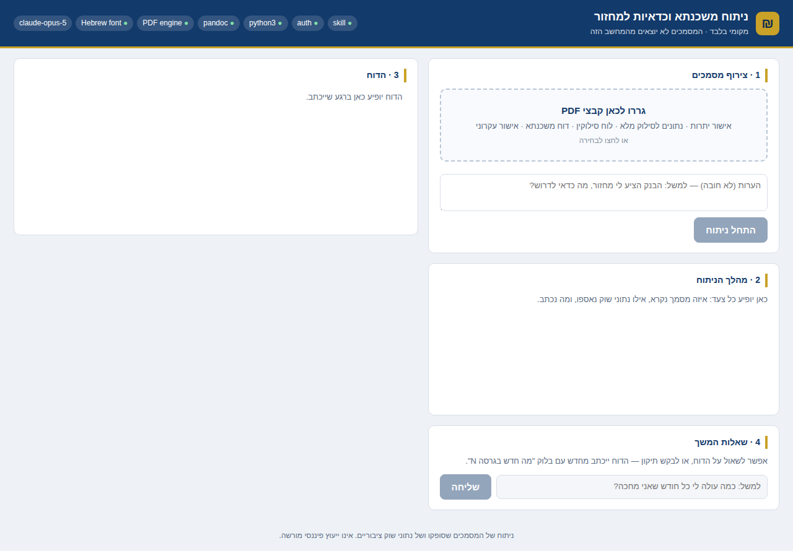

# Israeli Mortgage Analysis

A Claude plugin that reads Israeli bank mortgage documents and produces a full Hebrew refinancing analysis report as Markdown and a styled RTL PDF.

## What it does

Israeli mortgages are split into tracks (`מסלולים`) with different rate mechanisms, linkage bases, and reset cycles. Whether refinancing makes sense is a per-track question, and the answer is frequently counterintuitive — an old fixed non-linked track is usually worth protecting at all costs, while an index-linked track that just reset can be quietly costing far more in nominal terms than its stated real rate suggests.

This plugin extracts every figure from the bank's own statements, **verifies the extraction against reconciliation identities**, ranks each track by refinancing priority using the bank's own `שיעור הריבית לצרכי השוואה`, and writes a report the borrower can take to their banker.

### Two modes

| Mode | Inputs | Output |
|---|---|---|
| **A** | `אישור יתרות משכנתא` / `נתונים לסילוק מלא` / `לוח סילוקין` | `ניתוח משכנתא וכדאיות למחזור` — per-track diagnosis, refinancing priority, target terms to demand, action items |
| **B** | The above **plus** `אישור עקרוני להלוואה לדיור` | Full opinion — recommendation, small-print findings, economic analysis at the borrower's actual horizon, stress tests, exit-station plan, action items |

<div dir="rtl">

## מדריך מהיר · עברית

הכלי קורא את מסמכי המשכנתא שהבנק נותן לכם, ומפיק **דוח ניתוח וכדאיות מחזור בעברית** — מסלול אחר מסלול, כשכל מספר בדוח מאומת מול הסכומים של הבנק עצמו.

**מה לבקש מהבנק:** `אישור יתרות משכנתא` או `נתונים לסילוק מלא` — אחד לכל מספר תיק. אם יש לכם גם הצעת מחזור (`אישור עקרוני להלוואה לדיור`), צרפו גם אותה ותקבלו חוות דעת מלאה על ההצעה עצמה.

**שלוש דרכים להשתמש, מהקלה למתקדמת:**

1. **הכי מהיר, בלי להתקין כלום** — פותחים צ׳אט ב-claude.ai, מצרפים את קובצי ה-PDF, ומדביקים את הפרומפט המוכן שב[מסלול 0](#option-0--quickest-look-nothing-to-install).
2. **הכי מומלץ לשימוש חוזר** — מורידים את `mortgage-refinance-analysis.zip` מ[הגרסה האחרונה](../../releases/latest), ומעלים אותו ב-claude.ai דרך **Customize → Skills → Upload skill**. פירוט ב[מסלול A](#option-a--claudeai-or-the-claude-app--no-terminal).
3. **ממשק גרפי על המחשב שלכם** — [Quick start](#quick-start--the-dashboard-no-coding-needed): גוררים את קובצי ה-PDF לדף, לוחצים על כפתור אחד, ומקבלים את הדוח. דורש התקנה חד-פעמית.

**אין גרסה מקוונת, וזה במכוון.** הניתוח רץ מול חשבון ה-Claude שלכם, והמסמכים לא עוזבים את המחשב שלכם. אנתרופיק גם אינה מתירה לאפליקציות צד-שלישי להציע התחברות עם חשבון Claude.

הדוח אינו ייעוץ פיננסי מורשה. מטרתו לתת לכם את המספרים ואת השאלות הנכונות מול הבנקאי או היועץ.

</div>

## Quick start — the dashboard (no coding needed)

A web page on your own computer: drag the bank PDFs in, press one button, get the report. Your documents never leave your machine. This is the easiest way to use this project, whether or not you write code — the only requirement is a **paid Claude plan**.



There are two one-time setup steps (1–2), then starting the app (3). Everything below is typed into the **Terminal** app — on a Mac, press `⌘`+`Space`, type `terminal`, press Enter. Copy-paste each block as-is.

**Step 1 — install Node.js** (the engine the app runs on). Go to [nodejs.org](https://nodejs.org), download it, and install it like any other app. To check it worked, paste this in Terminal — any number 20 or higher is fine:

```bash
node --version
```

**Step 2 — log in to Claude.** Paste these two lines, one at a time:

```bash
npm install -g @anthropic-ai/claude-code
claude
```

When Claude opens, type `/login` and press Enter — your browser opens, you log in with your Claude account, and you're done. Type `exit` to leave. You will never need to do this again.

**Step 3 — get the app and start it.** Paste:

```bash
git clone https://github.com/OrrZwebner/israeli-mortgage-analysis
cd israeli-mortgage-analysis
./run.sh
```

> If a window pops up asking to install *command line developer tools*, click **Install**, wait for it to finish, and paste the block again.

The script installs what it needs (first run only), checks everything, and opens your browser at the dashboard. If something is missing, it stops and tells you exactly what to do — fix that one thing and run `./run.sh` again.

Then: **drag the bank PDFs into the page and press התחל ניתוח.** The analysis takes a few minutes; you can watch every step in the log. When it finishes, the Hebrew report appears on the page.

**From then on**, starting the app is just:

```bash
cd israeli-mortgage-analysis
./run.sh
```

**Want it on your phone?** Start with `./run.sh --mobile` instead and scan the QR code it prints (phone and computer on the same Wi-Fi).

**Want the downloadable PDF too?** Install [pandoc](https://pandoc.org/installing.html) (`brew install pandoc`, or the installer on that page). Without it everything still works — the report displays in the browser and you can print it to PDF from there.

Full walkthrough, troubleshooting, and what the app is permitted to do: [`web/README.md`](web/README.md).

## Other ways to use it

The skill also works conversationally inside Claude itself — no dashboard, you attach the PDFs to a chat and ask. Pick the option that matches how you use Claude:

| How you use Claude | Use |
|---|---|
| You just want to see what it says, right now | **Option 0** — paste a prompt, install nothing |
| In the browser at **claude.ai**, or the Claude desktop app | **Option A** — upload one file, no terminal |
| In **Claude Code** (terminal) | **Option B** — install as a plugin |
| In **Claude Code**, and you want the skill without the plugin wrapper | **Option C** — copy the skill folder |

---

### Option 0 — quickest look, nothing to install

Nothing to download and nothing to set up. Claude reads the skill's own files straight out of this repository, so you get the same method without installing it.

1. Open a new chat at **claude.ai** (web access must be enabled).
2. Attach your mortgage PDFs.
3. Paste this:

```
מצורפים אישורי יתרות משכנתא לניתוח.

לפני שאתה מתחיל, קרא את הקבצים הבאים ופעל לפיהם במדויק:
https://raw.githubusercontent.com/OrrZwebner/israeli-mortgage-analysis/main/skills/mortgage-refinance-analysis/SKILL.md
https://raw.githubusercontent.com/OrrZwebner/israeli-mortgage-analysis/main/skills/mortgage-refinance-analysis/references/extraction.md
https://raw.githubusercontent.com/OrrZwebner/israeli-mortgage-analysis/main/skills/mortgage-refinance-analysis/references/calculations.md
https://raw.githubusercontent.com/OrrZwebner/israeli-mortgage-analysis/main/skills/mortgage-refinance-analysis/references/regulations.md
https://raw.githubusercontent.com/OrrZwebner/israeli-mortgage-analysis/main/skills/mortgage-refinance-analysis/references/report-structure.md

חלץ כל נתון מהמסמכים, אמת את החילוץ מול הסכומים של הבנק עצמו,
בדוק את תנאי השוק העדכניים, וכתוב את הדוח המלא בעברית לפי report-structure.md.
```

> **This is the weakest of the routes**, and worth knowing why. Pasting a bare link to this repository does *not* load the skill — Claude reads the README at best and writes a confident report without the reconciliation checks, which is the exact failure this skill exists to prevent. The prompt above fixes that by naming the files. Even so, `mortgage_calc.py` never runs, so the arithmetic is checked by hand rather than by the script, and there is no styled RTL PDF. Fine for a first look; use **Option A** if the answer will inform a real decision.

---

### Option A — claude.ai or the Claude app · no terminal

You never open a terminal and never install anything on your computer. Requires a paid Claude plan.

1. Download **`mortgage-refinance-analysis.zip`** from the [latest release](../../releases/latest). Don't unzip it.
2. Go to **claude.ai** → **Customize** in the left sidebar → **Skills**.
3. Click **Upload skill**, pick the file you just downloaded, and make sure the toggle next to **mortgage-refinance-analysis** is **on**.

Then start a new chat, attach your mortgage PDFs, and ask in Hebrew — see [Usage](#usage). Claude loads the skill by itself once it sees the documents; you don't need to name it.

> Use the release file, not the green **Code → Download ZIP** button. That button gives you the entire repository, which buries `SKILL.md` three folders deep and won't be recognized as a skill. The release archive is built for uploading as-is.

**Which files to attach** — ask your bank for `אישור יתרות משכנתא` or `נתונים לסילוק מלא`, one per file number (`תיק`). Add the refinancing offer (`אישור עקרוני להלוואה לדיור`) if you have one, and you get the fuller Mode B opinion.

**About the PDF** — the Hebrew report always works. The styled RTL PDF needs `pandoc` plus a PDF engine (`wkhtmltopdf`, or any Chromium-family browser) in the runtime, which is not guaranteed on claude.ai. If it fails, the Markdown report is complete on its own and you can print it to PDF from your browser.

---

### Option B — Claude Code, as a plugin

Run these two commands inside Claude Code. Nothing to download by hand.

```
/plugin marketplace add OrrZwebner/israeli-mortgage-analysis
/plugin install israeli-mortgage-analysis
```

---

### Option C — Claude Code, as a standalone skill

If you'd rather not add a marketplace, copy `skills/mortgage-refinance-analysis/` into `~/.claude/skills/` (personal) or `.claude/skills/` (one project). Same skill as Option B, without the plugin wrapper or its updates.

## Usage

With the dashboard there is nothing to type — drag the PDFs in and press the button. With Options A–C the skill is conversational: attach the PDFs and ask in either language:

```
מצורפים אישורי יתרות של המשכנתא שלי — תנתח ותגיד אם כדאי למחזר
```

```
מצורפים אישורי יתרות והצעה למחזור מהבנק. תן חוות דעת מלאה.
```

The skill triggers on mentions of `מחזור משכנתא`, `אישור יתרות`, `אישור עקרוני`, `כדאיות מחזור`, prepayment fees, or comparing mortgage tracks.

## What it checks that people miss

- **Rate resets that already happened** — variable tracks reset on a cycle from origination; a reset often explains a payment jump the borrower hasn't registered, and is frequently the entire reason refinancing suddenly makes sense
- **Stale advisor reports** — third-party `דוח משכנתא` files go out of date the moment a track resets, understating the true cost
- **The 5% framework buffer** — refinancing approvals quote a framework ~5% above the real balance, which inflates every headline figure in the offer
- **Rate holding protects the margin, not the rate** — on variable tracks the quoted rate is indicative; the anchor is set at execution
- **Average-index fee timing** — on linked tracks, executing from the 16th of the month avoids it entirely, at zero cost
- **No-notice fee waiver** — the prepayment order waives it when the same bank funds the refinance
- **Composition limits** — Directive 329 defines "variable" more broadly than most commentary assumes, and its refinancing test is incremental rather than absolute

## Repository layout

```
.claude-plugin/plugin.json
skills/mortgage-refinance-analysis/
├── SKILL.md
├── references/
│   ├── extraction.md          field map for Israeli bank PDFs, RTL traps, verification identities
│   ├── calculations.md        Spitzer, index linkage, prepayment fees, horizon economics, break-even
│   ├── regulations.md         Directives 329 and 451, the 2002 prepayment order, uniform baskets
│   └── report-structure.md    section-by-section output structure for both modes
└── scripts/
    ├── mortgage_calc.py       calculations and extraction verification
    └── build_pdf.py           Hebrew Markdown to styled RTL A4 PDF

run.sh                         one-command launcher for the dashboard
web/                           the dashboard itself — Agent SDK + Express + one HTML page
├── src/                       agent wiring, permission gate, preflight checks
└── public/                    the page itself
```

## Scripts

```bash
# verify extracted tracks against the bank's own totals
python scripts/mortgage_calc.py verify tracks.json

# detect whether a rate reset has occurred
python scripts/mortgage_calc.py rate <balance> <monthly_payment> <months_remaining>

# Spitzer payment, index coefficient, delay cost, stress test
python scripts/mortgage_calc.py pmt <principal> <rate> <months>
python scripts/mortgage_calc.py index <principal> <known_index> <base_index>
python scripts/mortgage_calc.py delay <balance> <current_effective_rate> <offered_rate>
python scripts/mortgage_calc.py stress <principal> <rate> <months> <k> --scenarios 4.5 5.5 6.5

# render the report
python scripts/build_pdf.py report.md report.pdf
```

`build_pdf.py` requires `pandoc`, a Hebrew-capable font (DejaVu Sans on most Linux images), and a PDF engine. It uses `wkhtmltopdf` when installed and otherwise falls back to headless Chrome, Chromium, Edge, or Brave — found on `PATH`, at the usual macOS/Linux install locations, or via `CHROME_PATH`. Force one with `--engine wkhtmltopdf|chrome`.

## Scope

This produces an analysis of supplied documents and public market data. It is not licensed financial advice, and the reports it generates say so. Rates, forecasts, and regulatory text change — the skill searches for current market data at run time rather than relying on stored values, and decisive regulatory points should be verified against `boi.org.il`.
