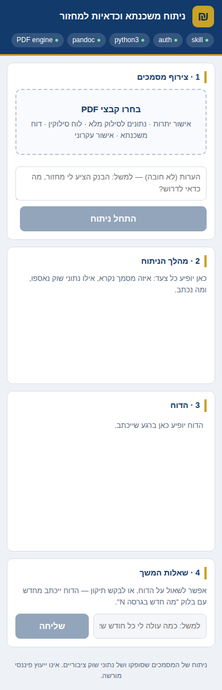

# ניתוח משכנתא — local web UI

A single-user dashboard for the `mortgage-refinance-analysis` skill. Drop the PDFs
your bank gave you onto a page, watch the analysis happen, and get back the Hebrew
report as Markdown and as a styled RTL PDF.

Everything runs on your machine: the server binds to `127.0.0.1`, the documents are
written to `web/runs/` and never leave the disk, and the analysis runs through your
own Claude login.


## 1. Prerequisites

Four things, and only the second one usually surprises people.

| | Check | Install | If it's missing |
|---|---|---|---|
| **Node 20+** | `node --version` | [nodejs.org](https://nodejs.org), or `brew install node` | Nothing runs. |
| **A logged-in Claude Code** | `claude` → type `/login` | [Claude Code](https://code.claude.com/docs) | The app starts, but every run fails with *Invalid API key · Please run /login*. **There is no separate login for this app** — it reuses Claude Code's credentials. |
| **pandoc** | `pandoc --version` | `brew install pandoc` (Linux: `apt install pandoc`) | The Hebrew report is still written and displayed; only the PDF fails. |
| **A Chromium-family browser** | any of Chrome / Chromium / Edge / Brave | you probably already have one | Same as above — no PDF, report unaffected. `wkhtmltopdf` also works if you have it. |

Python 3 is used by the skill's two scripts and ships with macOS; `npm run doctor`
will tell you if yours is missing.

## 2. Install and run

One script does everything — installs dependencies on the first run, checks the
environment, and starts the server:

```bash
git clone https://github.com/OrrZwebner/israeli-mortgage-analysis
cd israeli-mortgage-analysis
./run.sh
```

Open **http://127.0.0.1:5173**. `Ctrl-C` stops it; `./run.sh` starts it again.
Other modes:

```bash
./run.sh --mobile   # also reachable from your phone — prints a QR code (see §4)
./run.sh --doctor   # just the environment checks
./run.sh --smoke    # verify the skill loads and Claude is logged in
```

If a check fails, the script stops and tells you what to fix. When everything
passes, the checks look like this:

```
  ✓ skill        …/skills/mortgage-refinance-analysis/SKILL.md
  ✓ auth         Claude subscription login (…/.claude.json)
  ✓ python3      Python 3.11.x
  ✓ pandoc       pandoc 3.x
  ✓ PDF engine   chrome /Applications/Google Chrome.app/…
  ✓ Hebrew font  macOS system fonts cover Hebrew

Ready.
```

The first start also compiles the TypeScript, so it takes a few extra seconds
before the URL is printed. (Prefer npm directly? `cd web && npm install && npm
start` does the same thing; `npm run doctor` / `npm run smoke` / `npm run mobile`
match the script's flags.)

## 3. Using it

The page is four numbered panels, in the order you use them.

**1 · צירוף מסמכים** — drag the bank PDFs in, or click to pick them. Add a note if
you want to steer the analysis (*"הבנק הציע לי מחזור, מה כדאי לדרוש?"*), then press
**התחל ניתוח**.

**2 · מהלך הניתוח** — the live log. Every document read, every figure checked, every
market-rate search, every command run. A full analysis takes several minutes: it
reads each PDF, reconciles the numbers against the bank's own totals, and looks up
current Bank of Israel rates before it writes anything. When a turn finishes, its
duration and cost are printed — this is not free.

**3 · הדוח** — the finished report, rendered right-to-left. Toggle to **Markdown**
for the raw source, or download the `.md` / `.pdf`. The PDF is the same styled RTL
document the skill produces anywhere else.

**4 · שאלות המשך** — ask anything about the report. A question is answered in the
chat; a request for a change rewrites `report.md`, re-renders the PDF, and opens the
report with a `מה חדש בגרסה N` block naming what changed.

The URL carries the run id (`?job=…`), so you can reload, or reopen the page later,
and pick the same run back up. Everything also lives on disk under
`web/runs/<id>/` — `input/`, `report.md`, `report.pdf`, and `transcript.jsonl`.

### Which documents to give it

Ask your bank for **`אישור יתרות משכנתא`** or **`נתונים לסילוק מלא`** — one per file
number (`תיק`). A `לוח סילוקין` or an advisor's `דוח משכנתא` can be added too.

If you also attach a refinancing offer (**`אישור עקרוני להלוואה לדיור`**), the skill
switches from a portfolio analysis to a full opinion on the offer — recommendation,
small print, stress tests, exit stations. You don't have to say which; it works that
out from the documents.

## 4. From your phone

```bash
./run.sh --mobile
```

This binds to your LAN instead of loopback and prints a URL and a QR code in the
terminal; the desktop page also grows a **פתיחה בנייד** button showing the same code.
Scan it from a phone on the same Wi-Fi and you get the full app — attach PDFs from
Files, watch the run, read the report, ask follow-ups.



The link carries a **one-time access key**, generated fresh on every start. The first
request exchanges it for an `httpOnly` cookie, so the rest of the session works
normally; requests from the network without it get a 401, and stopping the server
revokes every paired phone. Requests from the machine itself are always allowed.

Understand what you're turning on: in mobile mode your mortgage documents, and an
agent that spends money, are reachable by anything on that network that has the key.
It's meant for your own home Wi-Fi, not a café or an office LAN. Plain HTTP means the
key is visible to anyone who can watch the traffic on that network.

The default (`./run.sh` without `--mobile`) stays bound to `127.0.0.1` and is not
reachable from anywhere else.

## 5. When something goes wrong

**The `auth` pill is red, or a run fails with *Invalid API key · Please run /login*.**
Claude Code isn't logged in on this machine. Run `claude` in a terminal, type
`/login`, finish in the browser, then restart the server. If you'd rather bill the
API than your subscription, `export ANTHROPIC_API_KEY=…` instead — the `auth` pill
tells you which is in effect.

**`./run.sh --smoke` fails.** Exit `2` means the skill loaded fine but Claude can't
run — that's the login problem above. Exit `1` means the plugin or skill didn't
load, which means the app is running from outside the repository; run `./run.sh`
from inside your clone.

**The `PDF engine` pill is amber and there's no PDF download.** No `wkhtmltopdf` and
no Chromium-family browser was found. Install Chrome, or point `CHROME_PATH` at a
browser you already have. The Markdown report is unaffected — it's the deliverable of
record, and you can print it from the browser.

**`Error: listen EADDRINUSE`.** Port 5173 is taken, usually by an older copy of this
server. Kill it, or use another port:

```bash
MORTGAGE_WEB_PORT=5174 ./run.sh
```

**The phone can't reach the URL.** Both devices must be on the same Wi-Fi; guest
networks and "client isolation" on the router will block it. On macOS, allow the
incoming-connection prompt the first time. If your machine has several network
addresses the terminal lists the alternatives — try the next one.

**A run ends with *הריצה הסתיימה בלי שנוצר report.md*.** The agent stopped before
writing the report. Read the log for what it was doing; `web/runs/<id>/transcript.jsonl`
has the full record, including any refused commands.

**The report has numbers that don't reconcile.** That's the skill working, not
failing — unreconciled figures are reported deliberately rather than smoothed over,
because they're the most useful thing to take to your banker.

## 6. Verifying the wiring

```bash
./run.sh --smoke      # confirms the plugin and skill load, and that Claude can run
cd web && npm test    # the permission gate's allow/deny rules
```

The smoke test exits `0` when everything is ready, `1` if the skill didn't load, and
`2` if the skill loaded but Claude isn't logged in.

## 7. How it works

```
browser ──▶ Express ──▶ Claude Agent SDK ──▶ Claude Code harness
                                              ├── plugin: this repository
                                              └── skill: mortgage-refinance-analysis
                          │
                          └── web/runs/<id>/  input/*.pdf · report.md · report.pdf · transcript.jsonl
```

Each run gets its own directory, which is also the agent's working directory. The
repository itself is loaded as a **local plugin**, so the skill is available by path —
no install step, and no dependence on however your own Claude Code is configured.
`settingSources: []` keeps your personal skills, settings, and `CLAUDE.md` files out
of a financial analysis.

The skill deliberately leaves output naming to the agent. A system-prompt appendix
(`src/prompt.ts`) pins it to `report.md` + `report.pdf` and forbids writing outside
the run directory; nothing else about the analysis is overridden.

### What the agent is allowed to do

Pre-approved: `Read`, `Glob`, `Grep`, `WebSearch`, `TodoWrite`, `Skill`.
Checked on every call by `src/permissions.ts`:

- **Write/Edit** — only inside the run directory.
- **Bash** — only an allowlist of executables (`python3`, plus read-only shell
  utilities); no command substitution, no `sudo`, and redirects must stay inside the
  run directory. Refusals appear in the progress log.
- **WebFetch** — allowed, and every URL is shown in the log. The skill needs live
  Bank of Israel data, so the network can't be closed off entirely; if a document
  ever tried a prompt-injection attack, this is the channel to watch.

This is a guard rail, not a sandbox. Read the progress log.

### Authentication

The Agent SDK reuses Claude Code's own credentials, so if `claude` works in your
terminal, this works. This is a personal tool you run for yourself — Anthropic's SDK
terms don't allow offering claude.ai login to other people, so don't put it on a
shared host.

## 8. Configuration

| Variable | Default | Purpose |
|---|---|---|
| `MORTGAGE_WEB_PORT` | `5173` | Listen port |
| `MORTGAGE_WEB_MOBILE` | unset | `1` binds to the LAN and enables the access key (`npm run mobile`) |
| `MORTGAGE_WEB_HOST` | `127.0.0.1`, or `0.0.0.0` in mobile mode | Bind address |
| `MORTGAGE_WEB_MODEL` | `claude-opus-5` | Model |
| `MORTGAGE_WEB_MAX_BUDGET_USD` | unset | Hard spend ceiling per turn |
| `MORTGAGE_WEB_BASH_ALLOW` | unset | Extra executables the agent may run, comma separated |
| `CHROME_PATH` | unset | Browser to use for PDF rendering |
| `ANTHROPIC_API_KEY` | unset | Bills the API instead of your Claude subscription |
